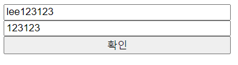
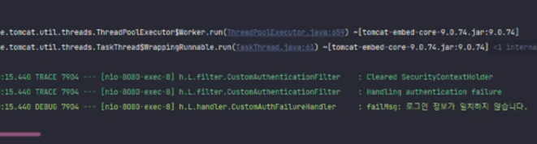

# 🛠️NINETO6 사이드프로젝트 만들기

## 시작하기 전에...

<br/>
<p>


<p/>

- 현재 `Front-End` 와 `Back-end` 는 다른 환경에서 개발하고 있음
- **Proxy** 를 사용하지 않음

<br/>
<hr/>

###### 20230502

> ## Form 수정 후 Internal Server Error 500

원래 쓰던 회원가입 Form 을 수정하니 Internal Server Error 500 가 났다.

<br/>

<br/>
<br/>

```TS
function App() {
  // const { data, isLoading, refetch } = useQuery("userData", getData, {
  //   onSuccess: (data) => {
  //     console.log(data);
  //   },

  //   onError: (error) => {
  //     console.log(error);
  //   },
  // }); // 2023.05.02 현재 GET 요청부분이 없으므로 주석처리

  const { mutate } = OnPostData();
```

<br/>

해당 사유를 알고보니 `Back-End` 에서 GET 요청을 받는 부분을 아직 만들지 않아 생긴 문제

간단하게 GET 요청을 주석처리 하여 해결 함

<br/>

> ## Log-In 요청

<br/>

로그인 요청을 제대로 받아오는지 확인하기 위해 **Form** 을 채워 `POST` 요청을 함

<br/>

<br/>

<br/>

<br/>

해당하는 데이터 값이 존재하지 않을 시 `failMsg` 를 통해 **"로그인 정보가 일치하지 않습니다."** 라는 메세지를 받음

`Database` 에 일치하는 데이터를 넣고 다시 `POST` 요청

<br/>

<br/>

일치하는 데이터가 있을 경우 해당 아이디 비밀번호 뿐만 아니라 다른 정보도 정상적으로 보이는 것을 확인

추후 **토큰화** 예정

<br/>
<br/>

> ## https 로 변경하기

<br/>

- 기존의 `localhost` 는 **http** 를 기반으로 동작하는데, **http** 를 사용하면 쿠키 사용에 번거로움이 있으므로 변경
- **https** 로 변경하기 위해 `window` 는 `choco`, `mac` 은 `brew` 를 사용해 `mksert` 를 사용
- [참고자료 1](https://velog.io/@horang-e/React-localhost-%ED%99%98%EA%B2%BD-HTTPS%EB%A1%9C-%EB%B0%94%EA%BE%B8%EA%B8%B0Windows) [참고자료 2](https://365ok.co.kr/okdown/7802)

<br/>

```json
  "scripts": {
    "start": "set HTTPS=true&&react-scripts start",
    "build": "react-scripts build",
    "test": "react-scripts test",
    "eject": "react-scripts eject"
  } // 단순히 set HTTPS 를 이용해 https 를 만들 수 있다.
```

<br/>

<br/>
<br/>

하지만 인증서가 없어서 위험하다는 경고 메세지가 출력

개발하는데에는 지장이 없지만 해결해보도록 하자

<br/>

```terminal
choco install mkcert // choco 를 사용해 mkcert 를 설치
mkcert -install // 인증서 발급을 위해 해당 프로젝트의 최상위 디렉토리로 이동 후 설치
```

<br/>

해당하는 `key` 와 `cert` 파일을 생성해 주어야 하므로

```terminal
mkcert -key-file ./key.pem -cert-file ./cert.pem "localhost"
```

<br/>

<br/>

그 이후 `SSL_CRT_FILE` 과 `SSL_KEY_FILE` 을 각각 **cert.pem**, **key.pem** 으로 매치 시켜줌

```json
  "scripts": {
    "start": "set HTTPS=true&&set SSL_CRT_FILE=cert.pem&&set SSL_KEY_FILE=key.pem&&react-scripts start",
    "build": "react-scripts build",
    "test": "react-scripts test",
    "eject": "react-scripts eject"
  },
```

<br/>

```
npm start
```

<br/>

<br/>
<br/>

경고창이 사라지고 `localhost` 가 **https** 로 정상 출력 되는 것을 볼 수 있음
