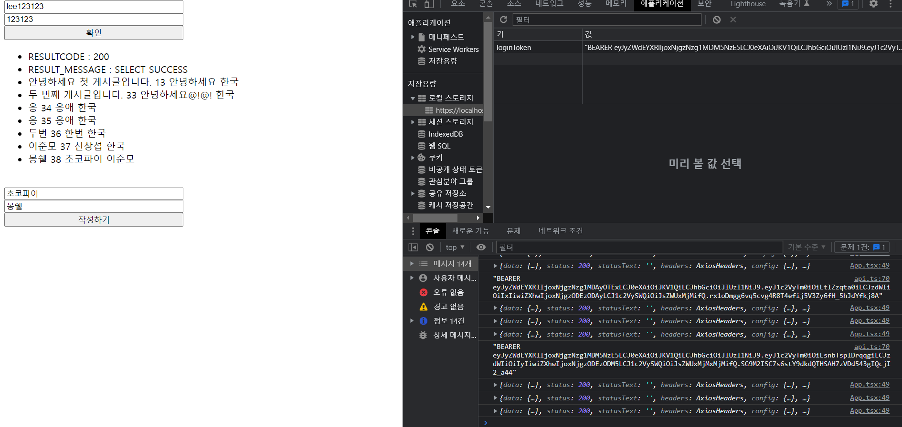

# 🛠️NINETO6 사이드프로젝트 만들기

## 시작하기 전에...

<br/>
<p>


<p/>

- 현재 `Front-End` 와 `Back-end` 는 다른 환경에서 개발하고 있음
- **Proxy** 를 사용하지 않음

<br/>
<hr/>

###### 20230502

> ## Form 수정 후 Internal Server Error 500

원래 쓰던 회원가입 Form 을 수정하니 Internal Server Error 500 가 났다.

<br/>

<br/>
<br/>

```TS
function App() {
  // const { data, isLoading, refetch } = useQuery("userData", getData, {
  //   onSuccess: (data) => {
  //     console.log(data);
  //   },

  //   onError: (error) => {
  //     console.log(error);
  //   },
  // }); // 2023.05.02 현재 GET 요청부분이 없으므로 주석처리

  const { mutate } = OnPostData();
```

<br/>

해당 사유를 알고보니 `Back-End` 에서 GET 요청을 받는 부분을 아직 만들지 않아 생긴 문제

간단하게 GET 요청을 주석처리 하여 해결 함

<br/>

> ## Log-In 요청

<br/>

로그인 요청을 제대로 받아오는지 확인하기 위해 **Form** 을 채워 `POST` 요청을 함

<br/>

<br/>

<br/>

<br/>

해당하는 데이터 값이 존재하지 않을 시 `failMsg` 를 통해 **"로그인 정보가 일치하지 않습니다."** 라는 메세지를 받음

`Database` 에 일치하는 데이터를 넣고 다시 `POST` 요청

<br/>

<br/>

일치하는 데이터가 있을 경우 해당 아이디 비밀번호 뿐만 아니라 다른 정보도 정상적으로 보이는 것을 확인

추후 **토큰화** 예정

<br/>
<br/>

> ## https 로 변경하기

<br/>

- 기존의 `localhost` 는 **http** 를 기반으로 동작하는데, **http** 를 사용하면 쿠키 사용에 번거로움이 있으므로 변경
- **https** 로 변경하기 위해 `window` 는 `choco`, `mac` 은 `brew` 를 사용해 `mksert` 를 사용
- [참고자료 1](https://velog.io/@horang-e/React-localhost-%ED%99%98%EA%B2%BD-HTTPS%EB%A1%9C-%EB%B0%94%EA%BE%B8%EA%B8%B0Windows) [참고자료 2](https://365ok.co.kr/okdown/7802)

<br/>

```json
  "scripts": {
    "start": "set HTTPS=true&&react-scripts start",
    "build": "react-scripts build",
    "test": "react-scripts test",
    "eject": "react-scripts eject"
  } // 단순히 set HTTPS 를 이용해 https 를 만들 수 있다.
```

<br/>

<br/>
<br/>

하지만 인증서가 없어서 위험하다는 경고 메세지가 출력

개발하는데에는 지장이 없지만 해결해보도록 하자

<br/>

```terminal
choco install mkcert // choco 를 사용해 mkcert 를 설치
mkcert -install // 인증서 발급을 위해 해당 프로젝트의 최상위 디렉토리로 이동 후 설치
```

<br/>

해당하는 `key` 와 `cert` 파일을 생성해 주어야 하므로

```terminal
mkcert -key-file ./key.pem -cert-file ./cert.pem "localhost"
```

<br/>

<br/>

그 이후 `SSL_CRT_FILE` 과 `SSL_KEY_FILE` 을 각각 **cert.pem**, **key.pem** 으로 매치 시켜줌

```json
  "scripts": {
    "start": "set HTTPS=true&&set SSL_CRT_FILE=cert.pem&&set SSL_KEY_FILE=key.pem&&react-scripts start",
    "build": "react-scripts build",
    "test": "react-scripts test",
    "eject": "react-scripts eject"
  },
```

<br/>

```
npm start
```

<br/>

<br/>
<br/>

경고창이 사라지고 `localhost` 가 **https** 로 정상 출력 되는 것을 볼 수 있음

<br/>
<hr/>

###### 20230509

> ## Header Autorization 받아오기

<br/>

**Back-end** 에서 `header` 의 `Authorization` 을 담아 주기 위해 테스트.

테스트 `url` 에 `POST` 요청을 보냈으며 `request:200` 이 정상적으로 뜨는 것을 확인

<br/>

<br/>

<br/>

응답으로 받은 `result` 에 `Bearer + TOKEN` 값이 제대로 담겨 온 것을 확인 할 수 있음

이제 해당 테스트 url 이 아닌 기존에 사용하던 `api/user/login url` 에 연결

<br/>

<br/>

본 url 인 `api/user/login url` 의 **request-header** 에 `authorization` 이 제대로 담긴 것을 확인 할 수 있음

이제 해당하는 `TOKEN` 값을 `localStorage` 에 담아 사용 할 것

<br/>
<hr/>
<br/>

> ## localStorage 에 담기

<br/>

- `localStorage` 는 브라우저 내 **token** 을 저장해 다시 켜도 해당 값을 사용하기 위함 (login, logout)
- **응답의 header** (response.header) 는 `JSON` 형식이므로 **그냥 접근하면 null or undefined 오류**가 나므로 `JSON.stringify` 로 수정해 접근해야 함

<br/>

```TS
// api.ts
export const postData = async (data: IFormData) => {
  return await axios.post(API_URL, data).then((response) => {
    if (response.status === 200) {
      axios
        .post(API_URL, data)
        .then((response) => {
          console.log(response);
          let ACCESS_TOKEN = JSON.stringify(response.headers["authorization"]);
          // JSON 형식이므로 JSON.stringify 를 사용해 주어야 한다. (*대소문자 주의*)
          // ACCESS_TOKEN 으로 초기화
          console.log(ACCESS_TOKEN);
          localStorage.setItem("loginToken", ACCESS_TOKEN);

          console.log(localStorage.getItem("loginToken"));
          // localStorage 에 제대로 값이 담겼는지 확인하기 위해 사용
        })
        .catch((error) => {
          console.log(error);
        });
    }
  });
};
```

<br/>

<br/>

<br/>

`F12 > application > local storage` 를 확인해보면 해당 `localStorage` 에 정상적으로 `Token` 값이 적재 된 것을 볼 수 있음

<br/>

```TSX
//api.ts

// Header 에 값 넣어주는 방법 1.
  export async function getData() {
    const request: HeadersInit = new Headers();
    // Headers 로 직접 헤더를 생성
    let token = await JSON.parse(localStorage.getItem("loginToken") || "{}");
    // 새 Header 에 받아서 JSON 형식으로 바꿔 사용
    // JSON.parse 는 ts 내에서 || 로 빈 {} 값을 보내주어야 type error가 나지않음

    if (!token) {
      throw new Error("error");
    } else {
      request.set("authorization", token);
      // header 에 authorization 으로 값을 세팅 후
    }

    return await fetch(BOARD_URL, {
      method: "GET",
      headers: request, // 넣어줌
    }).then((response) => {
      ...

// Header 에 값 넣어주는 방법 2
  export const axiosPostData = async (data: IBoardData) => {
    return await axios.post(BOARD_URL, data, {
      headers: {
        Authorization: await JSON.parse(
          localStorage.getItem("loginToken") || "{}"
        ),
      },
    });
  };
```

<br/>
<hr/>

###### 20230511

> ## get-board (GET)

<br/>

- 게시글 임시정보인 `board` 를 가져오기 위해 `axios` 를 사용
- `header > Authorization` 에 `localStorage` 를 적재해 요청하는 것이 관건
- **header** 의 토큰이 존재하지 않을 시 요청을 거부함

<br/>

```TSX
  export async function axiosGetData() {
    const request: HeadersInit = new Headers();
    let token = await JSON.parse(localStorage.getItem("loginToken") || "{}");
    // 새 Header 에 받아서 JSON 형식으로 바꿔 사용
    // JSON.parse 는 ts 내에서 || 로 빈 {} 값을 보내주어야 type error가 나지않음

    if (!token) {
      throw new Error("error");
    } else {
      request.set("authorization", token);
    }

    return axios.get(BOARD_URL, {
      headers: {
        Authorization: token,
      },
    });
  }
```

<br/>

<br/>

<br/>

> ## write-board (POST)

<br/>

- 게시글을 작성하기 위해 임시 `form` 을 생성
- 원래 사용하던 로그인의 `useQuery` 와 겹치므로 `rename` 필요
- `localStorage` 에 담긴 토큰이 다르면 글 작성 시 **Back-End** 에서 국적이 바뀌게 설정

<br/>

```TSX
//api.ts
  export const OnAxiosPostData = () => {
    return useMutation(axiosPostData);
  };

  export const axiosPostData = async (data: IBoardData) => {
    return await axios.post(BOARD_URL, data, {
      headers: {
        Authorization: await JSON.parse(
          localStorage.getItem("loginToken") || "{}"
        ),
      },
    });
  };

//App.tsx
  const {
    register: boardReg,
    handleSubmit: boardHandle,
    setError: boardSetError,
    formState: { errors: boardErrors },
  } = useForm<IBoardData>();

  ...

  return (

  )
```

<br/>

<br/>

다른 토큰으로 로그인 후 글을 작성 시 정상적으로 국적이 바뀌는 모습
